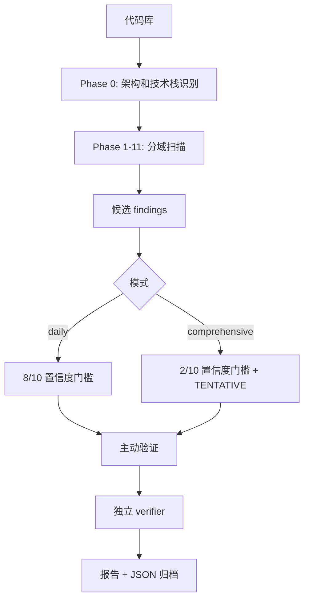

# 第 5 章 · /cso 深度拆解

> 如何把一个安全审计框架编码进 Skill——OWASP + STRIDE 的自动化实践

[[toc]]

## 设计概览

/cso 是 gstack 的安全审计 Skill。它的有趣之处在于：它没有把安全审计写成"跑几个扫描器"，而是把一位 Chief Security Officer 的判断过程拆成阶段、模式、置信度、误报过滤和验证任务。

它覆盖的范围很广：

- Secrets archaeology：找历史和当前代码中的秘密泄露
- Dependency supply chain：依赖、lockfile、已知漏洞、可达性
- CI/CD pipeline security：workflow、权限、第三方 action
- Infrastructure shadow surface：Docker、Terraform、K8s、配置
- Webhook & integrations：签名验证、TLS、OAuth scope
- LLM & AI security：prompt injection、工具调用、输出信任边界
- Skill supply chain：本地和全局 AI skill 的安全
- OWASP Top 10 + STRIDE threat model

但它最核心的设计其实只有一句话：安全报告必须有现实攻击路径，不能制造噪音。



## 源码精读

下面的源码引用都来自 [gstack/cso/SKILL.md](https://github.com/garrytan/gstack/blob/main/cso/SKILL.md)。

### 攻击面声明：安全审计不能只看业务代码

```yaml
name: cso
description: |
  Chief Security Officer mode. Infrastructure-first security audit: secrets archaeology,
  dependency supply chain, CI/CD pipeline security, LLM/AI security, skill supply chain
  scanning, plus OWASP Top 10, STRIDE threat modeling, and active verification.
  Two modes: daily (zero-noise, 8/10 confidence gate) and comprehensive (monthly deep
  scan, 2/10 bar).
```

为什么这样设计：安全 Skill 最怕范围不清。这里把 infra、依赖、CI/CD、LLM、skill supply chain 都写进 description，是为了让 Agent 不只盯着应用代码，也去看真正容易出事的边界层。

这段 frontmatter 的重点是 **Infrastructure-first**。很多安全事故不发生在业务函数里，而发生在 GitHub Actions 权限、未 pin 的 action、Docker 镜像、环境变量、webhook 签名和 AI tool calling 上。把这些写进 description，可以防止 Agent 把安全审计退化成"搜 SQL injection 和 XSS"。

### 范围解析：安全工具不能静默猜测

```markdown
3. Scope flags (`--infra`, `--code`, `--skills`, `--supply-chain`, `--owasp`, `--scope`) are **mutually exclusive**. If multiple scope flags are passed, **error immediately**...
Do NOT silently pick one — security tooling must never ignore user intent.
```

为什么这样设计：安全审计里的"我猜你是这个意思"很危险。互斥参数冲突时直接报错，比自动选择一个范围更诚实，因为漏扫比慢一点更糟。

这体现了安全工具的一个基本原则：宁可显式失败，也不要隐式漏扫。普通工具可以猜用户意图，安全工具不行。因为用户看到"审计完成"会默认相信覆盖了他们要求的范围。

### 新信任边界：LLM 安全为什么单独成章

```markdown
### Phase 7: LLM & AI Security

Use Grep to search for these patterns:
- **Prompt injection vectors:** User input flowing into system prompts or tool schemas
- **Unsanitized LLM output:** `dangerouslySetInnerHTML`, `v-html`, `innerHTML`
- **Tool/function calling without validation:** `tool_choice`, `function_call`, `tools=`
- **Eval/exec of LLM output:** `eval()`, `exec()`, `Function()`
```

为什么这样设计：传统 OWASP 不足以覆盖 AI 应用。gstack 单独设置 LLM phase，是因为模型输出、工具调用和系统提示词已经成为新的信任边界，不能只靠 Web 安全旧清单顺手带过。

这里不是把"AI 安全"写成抽象原则，而是落到可搜索的代码信号。比如用户输入进入 system prompt，不等于普通聊天输入；LLM 输出进入 HTML，不等于普通模板渲染；模型发起 tool call，也不等于用户点击按钮。这些都是新边界，所以需要单独 phase。

### 模式分层：日常零噪音，深扫可疑点

```markdown
**Daily mode (default, `/cso`):** 8/10 confidence gate. Zero noise. Only report what you're sure about.

**Comprehensive mode (`/cso --comprehensive`):** 2/10 confidence gate. Filter true noise only... Flag these as `TENTATIVE` to distinguish from confirmed findings.
```

为什么这样设计：日常安全检查和月度深扫不是同一个产品。日常模式如果噪音太多，团队会停止信任它；深扫模式则应该暴露更多疑点，但必须标记不确定性。

这其实是在为同一个 Skill 设计两种用户心态。daily 的用户想要"今天有没有必须修的洞"；comprehensive 的用户想要"还有哪些值得人工看一眼的风险"。同一个 finding 在两个模式下的呈现方式不同，才不会把可疑信号伪装成确定漏洞。

### 证据门槛：没有攻击路径就不是 finding

```markdown
**Exploit scenario requirement:** Every finding MUST include a concrete exploit scenario — a step-by-step attack path an attacker would follow. "This pattern is insecure" is not a finding.
```

为什么这样设计：安全报告的价值不在于指出"这看起来不安全"，而在于说明攻击者怎么走到这里。攻击路径会自动过滤大量理论风险，也让修复优先级更可靠。

这条规则会强迫 Agent 回答三个问题：攻击者控制什么输入？系统在哪个边界信任了它？最后能造成什么影响？如果答不出来，就说明它可能只是 pattern match，不应该进入主报告。

### 独立复核：用 fresh context 对抗误报

```markdown
For each candidate finding, launch an independent verification sub-task using the Agent tool. The verifier has fresh context and cannot see the initial scan's reasoning — only the finding itself and the FP filtering rules.
```

为什么这样设计：安全审计中，模型最容易把模式匹配当成漏洞。独立 verifier 是一种反偏见机制：让第二个上下文只看证据和过滤规则，减少第一个扫描过程的锚定效应。

这相当于把"复核人"写进 Skill。第一个 Agent 负责发现，第二个 Agent 负责怀疑。安全领域尤其需要这种分工，因为一个漂亮的漏洞叙述很容易让模型相信自己，而 fresh context 能减少顺着原推理继续编的风险。

## 设计决策

**决策 1：全面扫描，还是默认零噪音？**

gstack 选择双模式：daily 零噪音，comprehensive 广覆盖。单一模式很难服务两个场景：日常 CI 想要少而准，月度审计想要宁可多看一点。

**决策 2：按 OWASP 清单写，还是先按真实攻击面写？**

gstack 选择先按真实攻击面，再补 OWASP 和 STRIDE。因为现代项目的风险经常在 CI/CD、依赖、AI 工具调用、skill supply chain，而不是只在传统 Web controller 里。

**决策 3：报告 pattern，还是报告 exploit scenario？**

gstack 选择 exploit scenario。pattern 是扫描器视角，attack path 是安全负责人视角。后者能回答"为什么这是漏洞"和"攻击者怎么利用"。

**决策 4：自己验证，还是派独立 verifier？**

gstack 选择尽量派独立 verifier。代价是多一次模型调用和时间成本；收益是降低误报，尤其适合安全这种高风险输出。

## 你可以这样用

写安全类 Skill 时，可以直接复用 /cso 的五个部件：

1. **Mode resolution**：区分 daily 和 comprehensive，不要一个模式打天下。
2. **Phase map**：先列攻击面，再列每个阶段要找什么。
3. **FP rules**：把常见误报写成硬排除规则。
4. **Confidence gate**：不同模式用不同置信度门槛。
5. **Exploit scenario**：每个 finding 必须讲攻击路径。

一个简化模板：

```markdown
## Mode Resolution
Default mode reports only high-confidence findings. Deep mode reports tentative findings separately.

## Scan Phases
List each attack surface. For every phase, define search patterns, severity rules, and false-positive rules.

## Verification
Before reporting, trace the code path. Do not call live services unless explicitly allowed.

## Finding Format
Severity, confidence, file:line, exploit scenario, evidence, fix, verification status.
```

更有启发性的自查问题是：

> "如果我是攻击者，我需要哪三个条件同时成立，才能把这个 pattern 变成真实事故？"

这一章的小细节：/cso 把 `SKILL.md` 当成"可执行提示词代码"，所以安全扫描不能把它排除为普通文档。这提醒我们：Agent 时代的供应链不只包括 npm 包，也包括会改变 Agent 行为的指令文件。
