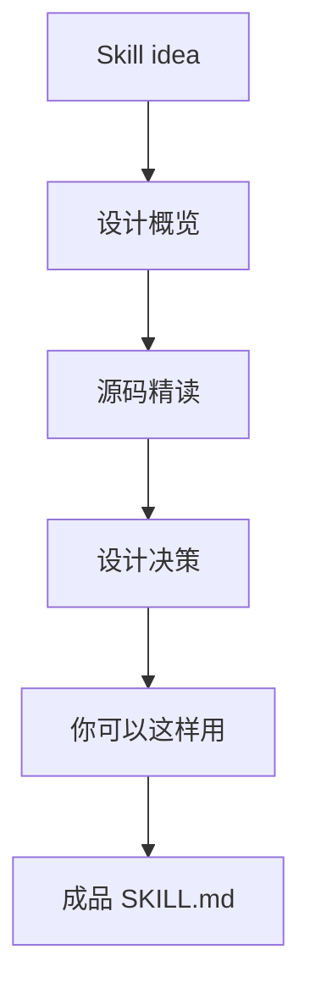

# 第 7 章 · 设计你自己的 Skill

> 综合实战——从模式识别到成品 Skill

[[toc]]

## 设计概览

前面几章我们拆了四类 Skill：

- /office-hours：把模糊想法变成设计文档
- /plan-eng-review：把工程直觉变成计划审查
- /cso：把安全审计变成证据驱动的扫描流程
- /ship：把发布变成有门禁的自动化流水线

这一章要把这些模式合起来，设计一个自己的 Skill：`code-smell-review`，用于发现代码异味并给出可执行修复建议。

目标不是写一个"代码风格检查器"。真正有用的代码异味 Skill 应该判断：

- 哪些复杂度会拖慢未来开发
- 哪些抽象现在还不值得存在
- 哪些重复代码应该合并，哪些重复是合理隔离
- 哪些命名、边界、测试缺口会让下一位维护者踩坑
- 哪些发现应该自动修，哪些必须问用户

我们仍然使用四段结构：



## 源码精读

这一章的源码引用主要来自 [gstack/skillify/SKILL.md](https://github.com/garrytan/gstack/blob/main/skillify/SKILL.md)，并借用其他 gstack Skill 的通用模式。

### 原子交付：半成品 Skill 不能落盘

```markdown
## Iron contract — never write a half-broken skill to disk

Skills are user-trust artifacts. A broken skill in `$B skill list` makes
agents reach for the wrong tool and erodes confidence. This skill writes
to a temp dir, runs the auto-generated test there, and only renames into
the final tier path on (a) test pass + (b) explicit user approval.
```

为什么这样设计：Skill 会影响 Agent 未来的行为。一个坏 Skill 不是普通坏文档，而是会被自动调用的错误能力。先临时目录、再测试、再批准、最后原子提交，是为了保护用户对工具列表的信任。

这段适用于所有"生成能力"的 Skill。只要产物会被未来自动发现和调用，就不能允许半成品进入正式路径。临时目录让失败有干净的回滚点，测试保证基本行为，用户批准保证命名和触发范围符合预期。

### 可发现性：名称和触发词决定 Skill 何时出现

```markdown
## Step 2 — Propose name + triggers

From the prototype intent, extract:

- A short skill name: lowercase letters/digits/dashes, ≤32 chars,
  starts with a letter, no consecutive dashes.
- 3–5 trigger phrases the agent should match against in future `/scrape`
  calls.
```

为什么这样设计：Skill 的触发词决定它什么时候会被拿出来用。名字太泛会误触发，名字太窄会找不到。把命名和触发词设计成显式步骤，是为了避免"能力写好了但路由失败"。

这里其实是在设计 Skill 的可发现性。`name` 是人和系统列表里看到的能力名，`triggers` 是自然语言到能力的桥。一个好 Skill 不仅要会做事，还要在正确时间出现，并在错误时间保持沉默。

### 验证门槛：测试不能只证明没有崩溃

```markdown
The test must include at least one ★★ assertion — parsed output has the expected
shape AND non-empty key fields — not a smoke ★ assertion. Smoke tests
that only check `parseFromHtml` doesn't throw are insufficient.
```

为什么这样设计：Skill 的验证应该证明关键行为存在，而不是证明它没有立刻崩。对任何可复用能力来说，最低有效测试都应该覆盖输出形状、关键字段和真实 fixture。

这条规则特别适合写进你自己的 Skill。很多自动化会用"不报错"冒充"正确"。gstack 要求 ★★ assertion，是在逼测试证明用户真正关心的行为：有数据、字段对、结构可消费。

### 复杂度嗅觉：改动规模本身就是信号

```markdown
If the plan touches more than 8 files or introduces more than 2 new classes/services, treat that as a smell and challenge whether the same goal can be achieved with fewer moving parts.
```

为什么这样设计：代码异味审查不能只看局部语法。复杂度本身就是 smell，而且它常常出现在 plan 或 diff 的规模上，而不是某一行代码里。

把这条借到 `code-smell-review` 里，可以让 Skill 不只盯着"函数长不长"，还看改动形态。一次改动跨太多文件、引入太多概念、需要太多协调，往往就是维护性风险的早期信号。

### 置信度表达：把主观判断变成可讨论的分数

```markdown
Every finding MUST include a confidence score (1-10):
```

为什么这样设计：代码异味比安全漏洞更容易主观化。给每个 finding 标置信度，可以让读者区分"确定会拖累维护"和"只是风格偏好"。

代码异味 review 最怕变成审美争论。置信度分数不是为了装科学，而是为了迫使 Agent 说明自己有多确定。高置信度 finding 应该有重复模式、真实调用路径或测试缺口支撑；低置信度内容应该进入 watchlist，而不是主报告。

## 设计决策

**决策 1：code smell Skill 是自动修复工具，还是审查工具？**

建议做成审查工具，带少量自动修复。命名、死代码、明显重复 import 可以自动修；抽象边界、模块拆分、测试策略必须问用户。代码异味往往涉及团队偏好和未来方向，不能全自动。

**决策 2：按 smell 类型审查，还是按风险审查？**

建议按风险审查。传统 smell 类型包括 Long Method、Large Class、Shotgun Surgery、Feature Envy，但用户真正关心的是哪些问题会影响改动速度、可靠性和理解成本。

可以把输出分成：

- P1：近期很可能导致 bug 或返工
- P2：会增加维护成本
- P3：风格和可读性建议

**决策 3：只看 diff，还是结合历史和测试？**

建议默认看 diff，同时读取相关上下文。只看 diff 会误判，因为重复代码可能是为了隔离两个稳定边界；结合历史和测试能判断这个 smell 是否真的会伤人。

**决策 4：报告越多越好，还是少而准？**

建议少而准。代码异味报告如果像 lint 一样刷屏，用户很快会忽略。宁可 5 个高价值发现，也不要 40 个"可以考虑"。

## 你可以这样用

下面是一份可以直接作为起点的 `code-smell-review/SKILL.md` 草案。

````markdown
---
name: code-smell-review
description: |
  Code smell review for maintainability risks. Use when asked to review code
  quality, find refactoring opportunities, or identify complexity before merging.
  Reports high-signal findings with confidence, evidence, and concrete refactor options.
allowed-tools:
  - Read
  - Grep
  - Glob
  - Bash
  - AskUserQuestion
triggers:
  - code smell review
  - find code smells
  - refactor review
  - maintainability review
---

# /code-smell-review

You are a senior engineer reviewing for maintainability risk, not style trivia.
Prefer fewer findings with stronger evidence.

## Step 0: Scope

Detect whether the user wants:

- Diff review: compare current branch against base
- File review: inspect named files
- Plan review: inspect a proposed implementation before code exists

If scope is unclear, ask one question. Do not review the whole repo by default.

## Step 1: Context

Read:

- The target diff or files
- Nearby tests
- Existing patterns in the same module
- TODOs or docs that mention the touched area

Use `rg` for searches. Prefer existing local patterns over generic best practices.

## Step 2: Smell Map

Check for:

- Complexity: large functions, nested conditionals, too many responsibilities
- Boundary leaks: UI knowing persistence details, services knowing presentation details
- Duplicate logic: repeated conditionals or transformations that should share a name
- Premature abstraction: generic helpers with only one real caller
- Hidden coupling: changes requiring edits across many unrelated files
- Error handling gaps: happy-path-only logic in user-facing flows
- Test smell: assertions that only prove rendering or non-crash behavior

## Step 3: Confidence Gate

Only report findings with confidence >= 7/10.

For confidence 5-6, include in "Watchlist" only if it may influence the next refactor.
Suppress pure taste issues.

## Step 4: Finding Format

For each finding:

```text
[P2] (confidence: 8/10) file:line — short title
Evidence: concrete code path or repeated pattern.
Why it matters: how this slows future change or increases bug risk.
Refactor option A: smallest safe improvement.
Refactor option B: more complete improvement, with tradeoff.
Tests: what should prove the refactor preserved behavior.
```

## Step 5: Ask Before Structural Change

If a fix changes public API, module boundaries, data model, or test strategy,
use AskUserQuestion. Recommend one option, but wait for explicit approval.

## Step 6: Output

Lead with findings ordered by severity.
If no issues meet the confidence gate, say so clearly and mention residual risk.
End with 1-3 small details the user may have missed.
````

把它放进项目时，建议目录是：

```text
.claude/skills/code-smell-review/SKILL.md
```

然后在项目的 `CLAUDE.md` 或团队 Skill routing 中补一条：

```markdown
- Code quality / maintainability / refactor review → invoke /code-smell-review
```

设计自己的 Skill 时，最后做一次检查：

- 是否有明确触发场景？
- 是否有不该触发的边界？
- 是否有证据门槛？
- 是否知道什么时候必须问用户？
- 是否产出可复用 artifact 或机器可读记录？
- 是否有验证步骤，而不是只靠模型自信？

这一章的小细节：一个 Skill 最重要的不是正文写得多完整，而是"它会不会在错误时间被调用"。触发词、description 和边界说明，决定了它是专家助手还是误触发的噪音源。
