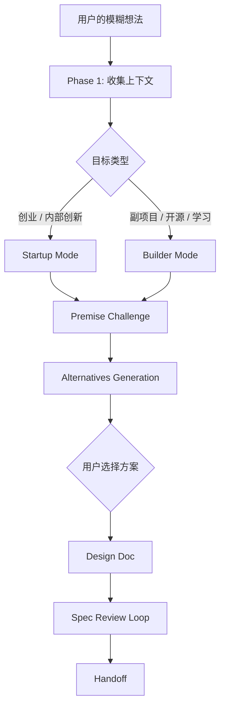

# 第 3 章 · /office-hours 深度拆解

> 如何设计一个"会提问"的 Skill——gstack 最核心的产品对话引擎

[[toc]]

## 设计概览

/office-hours 是 gstack 的入口 Skill。它不急着给方案，而是先把用户脑中还没有成形的东西逼近成一个可以执行、可以评审、可以交付的设计文档。

它的核心不是"多问几个问题"，而是把产品对话拆成一条有门控的认知路径：



这个设计有三个关键点。

第一，/office-hours 先判断"这是什么类型的工作"，再决定问题强度。Startup mode 像 YC partner，会追问真实需求、付费意愿、现状替代方案；Builder mode 像设计搭子，会帮你找到最酷、最快、最可分享的版本。

第二，它把每个重要判断都做成 STOP gate。AI 不能因为自己觉得某个方向好，就直接写进设计文档。尤其在方案选择阶段，它必须把 A/B/C 方案摆出来，让用户明确选择。

第三，它最终产出的不是聊天总结，而是一份可传递的设计文档。这份文档会成为后续 /plan-ceo-review、/plan-eng-review、/ship 的上游输入。

## 源码精读

下面的源码引用都来自 [gstack/office-hours/SKILL.md](https://github.com/garrytan/gstack/blob/main/office-hours/SKILL.md)。

### 入口契约：frontmatter 如何定义边界

```yaml
name: office-hours
description: |
  YC Office Hours — two modes. Startup mode: six forcing questions that expose
  demand reality, status quo, desperate specificity, narrowest wedge, observation,
  and future-fit. Builder mode: design thinking brainstorming for side projects,
  hackathons, learning, and open source. Saves a design doc.
  Use before /plan-ceo-review or /plan-eng-review. (gstack)
allowed-tools:
  - Bash
  - Read
  - Grep
  - Glob
  - Write
  - Edit
  - AskUserQuestion
  - WebSearch
```

为什么这样设计：description 不只是解释用途，它在做路由决策。它同时写了触发场景、两种模式、最终产物和下游顺序，所以 Agent 能知道什么时候应该先跑 /office-hours，而不是跳到架构或代码。

更细一点看，这段 frontmatter 编码了三层信息。第一层是**意图匹配**：用户说"brainstorm"、"is this worth building" 时应该触发。第二层是**工作边界**：这个 Skill 产出 design doc，不写代码。第三层是**流水线位置**：它必须先于 CEO review 和 Eng review，因为后两者审的是已经成形的产品方向和工程计划。

### 记忆接入：gbrain 如何带入历史上下文

```yaml
gbrain:
  schema: 1
  context_queries:
    - id: prior-sessions
      kind: list
      filter:
        type: ceo-plan
        tags_contains: "repo:{repo_slug}"
      sort: updated_at_desc
      limit: 5
      render_as: "## Prior office-hours sessions in this repo"
    - id: builder-profile
      kind: filesystem
      glob: "~/.gstack/builder-profile.jsonl"
      tail: 1
      render_as: "## Your builder profile snapshot"
    - id: design-doc-history
      kind: filesystem
      glob: "~/.gstack/projects/{repo_slug}/*-design-*.md"
      sort: mtime_desc
      limit: 3
      render_as: "## Recent design docs for this project"
    - id: prior-eureka
      kind: filesystem
      glob: "~/.gstack/analytics/eureka.jsonl"
      tail: 5
      render_as: "## Recent eureka moments"
```

为什么这样设计：这一段是在给 /office-hours 配一个"记忆系统"。如果没有这段配置，AI 每次运行 /office-hours 都像第一次见到这个项目：它不知道你之前讨论过什么，也不知道你已经做过哪些取舍。加上 gbrain 后，它可以在开始提问前，先读一点和当前项目有关的历史记录。

先不用理解 gbrain 的实现细节，可以把它想成一个小型资料柜。`context_queries` 就是在告诉 AI："这次开会前，请先从资料柜里取出这几类资料。"

| 查询 | 它取什么 | 给 /office-hours 带来的好处 |
| --- | --- | --- |
| `prior-sessions` | 这个项目最近 5 次产品讨论或 CEO plan | 避免重复问已经回答过的问题，也能接住之前定过的方向 |
| `builder-profile` | 你作为 builder 的偏好快照 | 让 AI 知道你更偏好快速原型、完整交付、设计感、开源还是商业化 |
| `design-doc-history` | 这个项目最近 3 份设计文档 | 让新设计能延续旧设计，而不是每次都从空白页开始 |
| `prior-eureka` | 最近记录下来的 5 个灵感时刻 | 保留之前突然发现的关键洞察，避免好想法在新会话里丢失 |

举个例子：你上周已经讨论过一个 TODO 工具，并决定"先做 CLI，不做 Web UI"。今天你再次运行 /office-hours，说"继续做 TODO 工具"。如果没有 gbrain，AI 可能又会问你要不要做 Web 界面；有了 gbrain，它能看到最近的设计文档，就更可能接着已有决定往下问："既然第一版锁定 CLI，那最重要的是命令体验、数据存储还是发布方式？"

这段真正值得学习的地方，不是"记忆越多越好"，而是**只拿当前任务最有用的少量记忆**。它限制了数量：最近 5 次 session、最近 3 份设计文档、builder profile 的最后 1 条、最近 5 个 eureka moments。这样做是为了避免历史资料太多，反而干扰当前判断。

对你设计自己的 Skill 来说，这里有一个很实用的原则：如果 Skill 需要记住历史，就要明确写出三件事：读哪类历史、最多读多少、用什么标题呈现给 AI。否则"记忆"会变成一堆杂乱上下文，反而让 Agent 更容易跑偏。

### 模式分流：先问目标，再决定问法

```markdown
5. **Ask: what's your goal with this?** This is a real question, not a formality. The answer determines everything about how the session runs.

   Via AskUserQuestion, ask:

   > What's your goal with this?
   > - **Startup** — I want this to become a company / revenue / users
   > - **Hackathon** — build something impressive fast
   > - **Open source** — useful tool for developers/community
   > - **Learning** — I want to understand/build to learn
```

为什么这样设计：同一句"我想做个工具"，在创业、学习和 hackathon 中需要完全不同的判断标准。先问目标，是为了避免把 YC 式拷问错误地用在周末小项目上，也避免把玩具式脑暴错误地用在商业项目上。

这个问题的厉害之处在于它不是收集背景，而是在选择评价函数。Startup 的好答案是"有人迫切需要并愿意付费"；Hackathon 的好答案是"能快速展示 wow moment"；Learning 的好答案是"能最大化理解和练习"。同一个功能，在三种目标下会导向三份完全不同的设计文档。

### 提问节奏：为什么一次只问一个问题

```markdown
Ask these questions **ONE AT A TIME** via AskUserQuestion. Push on each one until the answer is specific, evidence-based, and uncomfortable. Comfort means the founder hasn't gone deep enough.
```

为什么这样设计：问题必须一次一个，因为产品洞察通常来自追问后的第二个答案，而不是第一轮表面回答。一次性列出六个问题会让用户写作文，逐个推进才会暴露真实证据、矛盾和优先级。

这里有两个很重要的提示词技巧。第一是 **ONE AT A TIME**，它防止 Agent 把访谈变成问卷。第二是 **specific, evidence-based, uncomfortable**，它定义了合格答案的形状：不是"用户可能会喜欢"，而是"某个具体人现在用什么替代方案、为什么痛、有没有付费或催促信号"。

### 语气切换：Builder mode 为什么不是弱化版

```markdown
Ask these **ONE AT A TIME** via AskUserQuestion. The goal is to brainstorm and sharpen the idea, not interrogate.
```

为什么这样设计：Builder mode 没有把用户当成"还没经验证据的 founder"来审，而是把"兴奋感、可玩性、周末可交付"当成主要信号。好的 Skill 不是永远强硬，而是知道什么时候该换评价标准。

这也是 Skill 设计里很容易忽略的"语气路由"。同样是提问，Startup mode 的压力来自证据，Builder mode 的压力来自想象力。gstack 没有复用同一套问题，是因为一个好 Skill 不只是有流程，还要知道当前任务需要哪种人格。

### 决策门控：为什么必须 STOP 等用户选择

```markdown
Emit ONE AskUserQuestion that lists every alternative (A/B and optionally C) as numbered options...

**STOP.** Do NOT proceed to Phase 4.5 (Founder Signal Synthesis), Phase 5 (Design Doc), Phase 6 (Closing), or any design-doc generation until the user responds.
```

为什么这样设计：这是防止 AI "替用户决定产品方向"的硬闸。即使 Agent 有明确推荐，也只能推荐，不能把推荐伪装成已经确定的设计文档。

注意这里的 STOP 不是礼貌提醒，而是执行语义。它把"方案选择权"保留给用户，把"方案分析权"交给 Agent。这样既发挥了模型提出 alternatives 的能力，又避免它把推荐偷渡成事实。

## 设计决策

**决策 1：先提问，还是先给方案？**

gstack 选择先提问。坏处是慢一点，用户会感觉"我只是想让你帮我做，怎么还问这么多"。好处是它把错误前置到了最便宜的阶段：还没写代码，还没设计架构，还没产生沉没成本。

如果你在自己的 Skill 中处理的是需求、产品、研究、架构这类高歧义任务，也应该先设计问题流。只有当输入已经足够明确时，才进入执行流。

**决策 2：一种问法通吃，还是分 Startup / Builder 两种模式？**

gstack 选择分模式。统一问法看起来简单，但会把不同目标混在一起：对创业项目来说，"酷不酷"不是第一问题；对学习项目来说，"谁会付费"也不是第一问题。

分模式的代价是 Skill 变长，维护成本变高。但收益是每个问题都更贴近用户真实目标。

**决策 3：让 AI 直接写推荐方案，还是强制生成多个备选？**

gstack 选择强制 alternatives。一个方案容易让用户只在细节上修修补补；多个方案会逼用户看见真正的取舍，比如"最小可行"、"最酷版本"、"最稳版本"之间到底牺牲了什么。

**决策 4：设计文档直接输出，还是先做 review loop？**

gstack 选择先审再交付。/office-hours 后段会把设计文档交给 reviewer 检查清晰度、可实施性和风险。这说明它把文档当成工程输入，而不是聊天纪要。

## 你可以这样用

设计自己的"会提问"Skill 时，可以复用 /office-hours 的四层结构：

1. **入口分流**：先判断用户的目标类型，而不是急着执行。
2. **单问题推进**：每次只问一个能改变方向的问题。
3. **前提确认**：把隐含假设写成 premise，让用户确认。
4. **方案门控**：给出 2-3 个方案，推荐一个，但等待用户选择。

一个可迁移模板如下：

```markdown
## Phase 1: Context
Ask what success means for this task. Classify the request into one of N modes.

## Phase 2: Mode-specific questions
Ask one question at a time. Stop after each answer.

## Phase 3: Premise challenge
List the assumptions that must be true for this plan to work.

## Phase 4: Alternatives
Present A/B/C with tradeoffs. Recommend one. Stop for explicit approval.

## Phase 5: Artifact
Only after approval, write the durable artifact.
```

这一章最容易被忽略的小细节是：/office-hours 的厉害之处不是问题多，而是它知道哪些问题会改变后续工作流。你写 Skill 时也可以先问自己一句更有启发性的问题：这个 Skill 里，哪一个用户回答会彻底改变我的执行路径？
