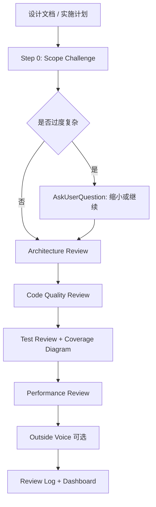

# 第 4 章 · /plan-eng-review 深度拆解

> 如何把工程直觉编码成可执行的架构审查流程

[[toc]]

## 设计概览

/plan-eng-review 的定位是"开工前的工程经理审查"。它不 review 已经写出来的 diff，而是 review 即将实施的 plan：架构、数据流、测试、性能、边界条件、发布路径。

它解决的是一个很常见的问题：AI 能很快写代码，但如果 plan 本身错了，写得越快，返工越快。

这套 Skill 的主线可以概括为：



它最重要的设计，不是列了多少检查项，而是把"工程判断"变成可执行门控：

- 复杂度超标要先挑战 scope
- 每个问题单独询问，不批量塞给用户
- 测试不是一句"补测试"，而是画出执行路径和用户路径
- 最终写入 review log，让 /ship 能判断是否已经通过工程审查

## 源码精读

下面的源码引用都来自 [gstack/plan-eng-review/SKILL.md](https://github.com/garrytan/gstack/blob/main/plan-eng-review/SKILL.md)。

### 评审身份：为什么它是交互式 plan review

```yaml
name: plan-eng-review
interactive: true
description: |
  Eng manager-mode plan review. Lock in the execution plan — architecture,
  data flow, diagrams, edge cases, test coverage, performance. Walks through
  issues interactively with opinionated recommendations.
benefits-from: [office-hours]
```

为什么这样设计：`interactive: true` 告诉 Agent 这不是批处理审查，而是和用户共同做取舍。`benefits-from: [office-hours]` 则把它放在正确链路上：先确定做什么，再评审怎么做。

这里的关键是"plan review"而不是"code review"。它审的是未来要做的事，所以必须互动。代码审查可以直接指出 bug，但计划审查常常涉及取舍：多做一层抽象还是保持简单、用现有数据库还是引入新组件、测试做到哪个层级。这些都需要用户确认风险偏好。

### 范围挑战：先问是不是做太大了

```markdown
### Step 0: Scope Challenge

3. **Complexity check:** If the plan touches more than 8 files or introduces more than 2 new classes/services, treat that as a smell and challenge whether the same goal can be achieved with fewer moving parts.

If the complexity check triggers (8+ files or 2+ new classes/services), STOP before any review-section work. Call AskUserQuestion...
```

为什么这样设计：很多架构问题不是"某个模块写得不好"，而是计划本身太大。把复杂度检查放在第 0 步，是为了在进入细节前先问：我们是不是已经把小问题做成了大工程？

这段把"工程直觉"量化成了一个可执行阈值。8 个文件、2 个新 service 并不是绝对真理，而是一个触发器：一旦超过，就必须解释为什么值得。好的 Skill 可以这样把模糊经验写成"触发审查的问题"，而不是假装经验无法编码。

### 单问题门控：架构取舍不能批处理

```markdown
For each issue found in this section, call AskUserQuestion individually. One issue per call. Present options, state your recommendation, explain WHY. Do NOT batch multiple issues into one AskUserQuestion.

**STOP.** Do NOT proceed to the next review section, edit the plan file with the proposed fix, or call ExitPlanMode until the user responds.
```

为什么这样设计：架构取舍不能被批处理。把 6 个问题塞进一个回答，会让用户只处理最显眼的两个，其他决策默认滑过去。单问题门控把每个设计选择都变成显式承诺。

这也是 gstack 对"用户主权"的实现方式。Agent 可以强烈推荐，但不能把推荐直接落进 plan。尤其是架构层面的变化，一旦写进计划，后面的编码 Agent 会把它当成事实执行，所以这里必须在写入前停住。

### 覆盖率地图：测试计划要画路径

```markdown
**Step 1. Trace every codepath in the plan:**

Read the plan document. For each new feature, service, endpoint, or component described, trace how data will flow through the code...

**Step 4. Output ASCII coverage diagram:**

Include BOTH code paths and user flows in the same diagram. Mark E2E-worthy and eval-worthy paths:
```

为什么这样设计：测试计划最大的失败模式是抽象承诺，比如"添加单元测试和集成测试"。gstack 要求画路径，是为了把测试从态度变成清单：每个分支、每个用户流程、每个错误状态是否有证据覆盖。

这里的设计比普通"测试矩阵"更进一步。它要求同时看代码路径和用户路径，因为真实 bug 经常藏在二者交界处：某个函数有单测，但用户流程没有覆盖；某个页面能渲染，但错误状态没人点过；某个 LLM prompt 能返回结果，但质量没有 eval。

### 评审日志：让 /ship 能读懂审查状态

```markdown
~/.claude/skills/gstack/bin/gstack-review-log '{"skill":"plan-eng-review","timestamp":"TIMESTAMP","status":"STATUS","unresolved":N,"critical_gaps":N,"issues_found":N,"mode":"MODE","commit":"COMMIT"}'
```

为什么这样设计：评审不是聊完就消失。写入 review log 后，/ship 可以检查 Eng Review 是否在 7 天内通过、是否对应当前 commit。这让 Skill 之间形成流水线，而不是一堆孤立命令。

这段体现了 Skill 之间的"机器可读契约"。人类读的是建议，后续 Skill 读的是状态、commit 和 unresolved 数量。没有这层记录，/ship 就只能相信用户说"我 review 过了"，无法判断 review 是否过期或是否针对当前 diff。

## 设计决策

**决策 1：先审 scope，还是直接审架构？**

gstack 选择先审 scope。直接进入架构会默认接受计划规模，但真正的高级工程判断经常是"这个不该做这么大"。Step 0 把过度设计变成第一等问题。

代价是它可能显得不够顺从。收益是它能在最早阶段阻止无意义复杂度。

**决策 2：一次性输出完整 review，还是每个问题都 AskUserQuestion？**

gstack 选择逐项互动。一次性输出适合静态报告，但架构评审往往需要用户确认业务约束、团队偏好和风险承受能力。每个问题都让用户选择，可以避免 AI 把自己的偏好写进 plan。

**决策 3：测试审查按文件列，还是按执行路径列？**

gstack 选择按执行路径。按文件列测试会遗漏跨模块流程，尤其是用户点击、API、异步任务、错误恢复这类路径。执行路径图更费 token，但能直接暴露"没人测过这个失败分支"。

**决策 4：只给建议，还是写 review log？**

gstack 选择写日志。建议是给人看的，review log 是给后续 Skill 用的。这个设计让 /ship 能把工程评审作为发布门禁，而不是靠用户记忆。

## 你可以这样用

如果你要写一个"计划审查类"Skill，可以借 /plan-eng-review 的结构：

```markdown
## Step 0: Scope Challenge
Before reviewing details, check whether the plan is too large, too custom, or missing a simpler path.

## Section 1: Architecture
Check boundaries, data flow, ownership, failure modes, and distribution path.

## Section 2: Code Quality
Check reuse, naming, maintainability, and whether existing patterns are being ignored.

## Section 3: Tests
Trace code paths and user flows. Produce a coverage diagram.

## Section 4: Performance
Check hot paths, data size, concurrency, and operational cost.

## Required Output
Write a machine-readable review record for downstream workflows.
```

一个很实用的提问方式是：

> "这份计划里，哪一部分如果判断错了，会让我们两周后最想重写？"

这比"架构有没有问题"更锋利。它会把评审焦点从审美拉回风险、返工和证据。

这一章的小细节：/plan-eng-review 把 ASCII diagram 当成工程资产，而不是装饰。图不是为了好看，是为了让路径、分支和测试缺口无法躲在自然语言里。
