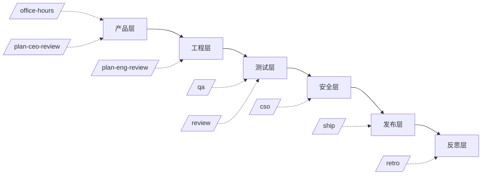

# 第 1 章 · 总论：什么是 Agent Skill

> 先理解 What，再追问 How。这一章建立 Agent Skill 设计的全局认知框架。

[[toc]]

## 什么是 Agent Skill

Agent Skill 是一套**可复用的能力模块**。它把领域专长编码为 Markdown 指令，让通用 AI 编程助手（Claude Code、Codex、Gemini CLI）在特定场景下表现出专家级行为。

一个 Skill 本质上就是一个 `SKILL.md` 文件：

```yaml
---
name: my-skill
description: 一句话描述这个 skill 做什么
---

# 指令内容
具体的分步指令、决策规则、验证门控...
```

## 为什么 Skill 设计重要

通用 AI 助手就像一个全科医生——什么都能看，但什么病都不精。Skill 就是给它配专家会诊。

**好的 Skill 设计能：**
- 消除模糊性——把"帮我 review 代码"变成结构化的 checklist 审查
- 编码工程判断——不是"这个代码对不对"，而是"这个设计决策在什么场景下是错的"
- 建立门控机制——校验点确保 AI 的输出经过了明确的质量门槛

**坏的 Skill 设计等于：**
- 堆砌大段未经消化的文档，撑爆 context window
- 写成操作手册（"点这个按钮"）而不是决策指南（"当 X 条件成立时选 Y 方案"）

## gstack：Skill 设计的最佳案例

gstack 是目前最完整的开源 Agent Skill 集合——28 个 Skill 覆盖了从产品构思到生产部署的完整软件开发流水线：



<span class="caption">gstack 的 7 层架构——每层由多个 Skill 组成</span>

## 本书的阅读路径

这本书按照「先用后懂」的逻辑组织：

- **第 2 章**：用一个真实小项目带你走完 gstack 完整工作流——先上手，产生好感
- **第 3-6 章**：深度拆解 4 个核心 Skill 的设计思路——看高手怎么写 Skill
- **第 7 章**：综合练习——从 0 设计一个自己的 Skill

## Skill 设计核心原则

在深入具体案例之前，先记住这 5 条原则。每一条都会在后续章节反复出现：

1. **模块化而非整体化**——每个 Skill 只做一件事，做好
2. **渐进式加载**——frontmatter → 正文 → 脚本 → 参考文献，按需加载
3. **验证门控**——每个 Skill 必须包含不可跳过的证据要求
4. **上下文最小化**——只加载当前任务所需的内容，避免 token 膨胀
5. **可自纠正**——Skill 内建错误处理、回退策略和反模式警告
